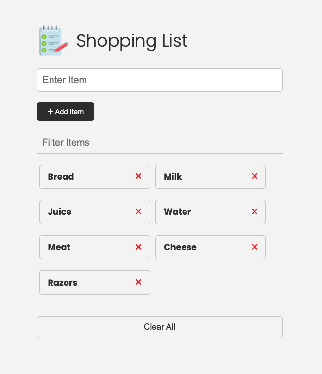

# Shopping List Project

## Description

This project is a simple shopping list application that allows users to add, edit, and delete items from their shopping list.

Vanilla JavaScript shopping list app from my Modern JS From The Beginning course.

This project was created to focus on working with the DOM, events, state, local storage and other fundamentals of JavaScript.



## Prerequisites

Before you begin, ensure you have met the following requirements:

- You have installed [Node.js](https://nodejs.org/) (which includes npm).
- You have a code editor like [Visual Studio Code](https://code.visualstudio.com/).

## Installation

To install the project, follow these steps:

1. Clone the repository:

   ```bash
   git clone https://github.com/your-username/shopping-list-project.git
   ```

2. Navigate to the project directory:

   ```bash
   cd shopping-list-project
   ```

3. Install the dependencies:
   ```bash
   npm install
   ```

## Running the Project

To run the project, use the following command:

```bash
npm start
```

This will start the development server and you can view the application in your browser at `http://localhost:3000`.

## Running Tests

To run tests, use the following command:

```bash
npm test
```

## Contributing

If you would like to contribute to this project, please fork the repository and create a pull request.

## License

This project is licensed under the MIT License.
